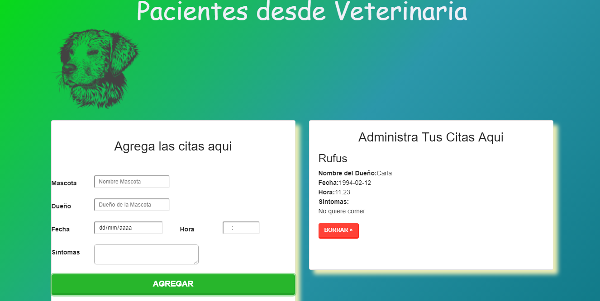

# adminPacienteVeterinaria
Este proyecto es un SPA (single page application) realizado con React para administrar las citas de los pacientes de una veterinaria simple.

Puedes probar la aplicacion en el siguiente link: https://adminpacienteveterinaria.firebaseapp.com :) 
 
 

       INICIALIZANDO PROJECTO:
 1) Descargar el codigo, clonar el repositorio.
 2) abrir una nueva consola cmd en el caso de windows ubicarse dentro de la carpeta con el projecto.
 3) instalar los modulos de nodejs, ejecutando el comando: npm install
 4) una vez instalados los archivos de punto 3), ejecturar el comando: npm start 

